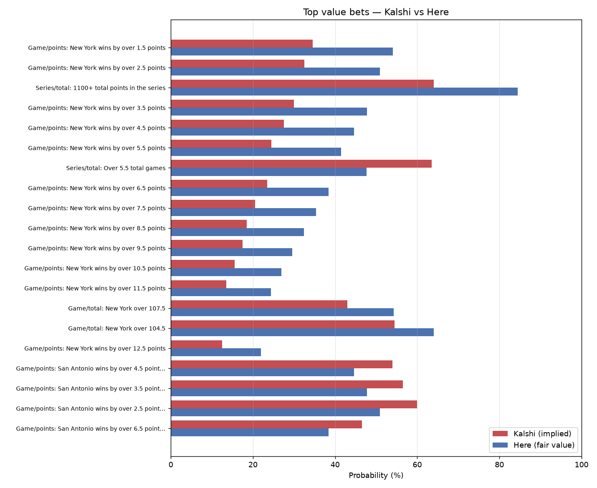
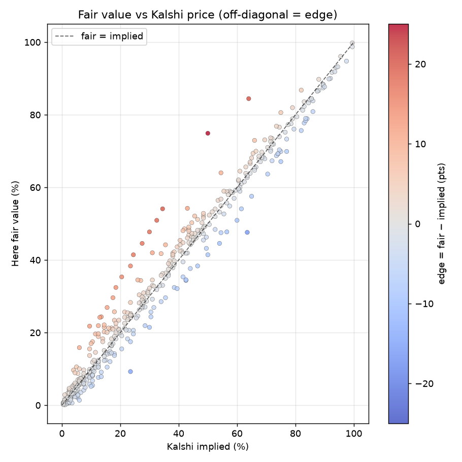
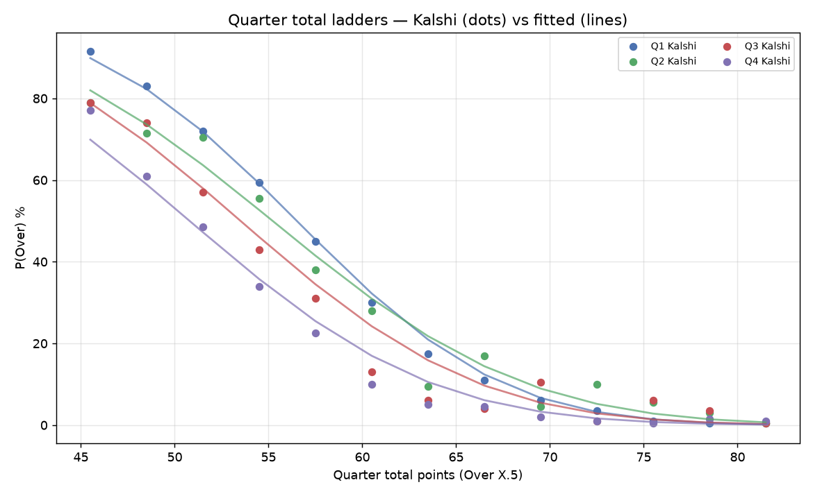

# Spurs vs Knicks — Kalshi vs Here

_Generated 2026-06-14 00:20 UTC from live Kalshi data._

**Kalshi** = market implied probability. **Here** = this tool's fair value (normal-fit strike ladders + de-vigged outcomes). **Edge** = Here − Kalshi. **EV/$1** = expected profit per $1 contract.

## Summary

| Stat | Value |
|---|---|
| Markets found | 719 (719 priced) |
| Markets with a fair value | 455 |
| Value bets (edge ≥ 5%) | 80 |
| Top-20 mean edge | 13.5 pts |
| Top-20 median edge | 13.0 pts |
| Best EV/$1 | +0.19 |

## Graphs

## Each bet: Kalshi vs Here

| # | Period | Metric | Bet | Side | Kalshi | Here | Edge | EV/$1 |
|--:|---|---|---|:--:|--:|--:|--:|--:|
| 1 | Game | points | New York wins by over 1.5 points | YES | 34.5% | 54.1% | +19.6 | +0.19 |
| 2 | Game | points | New York wins by over 2.5 points | YES | 32.5% | 50.9% | +18.4 | +0.18 |
| 3 | Series | total | 1100+ total points in the series | YES | 64.0% | 84.4% | +20.4 | +0.17 |
| 4 | Game | points | New York wins by over 3.5 points | YES | 30.0% | 47.7% | +17.7 | +0.17 |
| 5 | Game | points | New York wins by over 4.5 points | YES | 27.5% | 44.6% | +17.1 | +0.17 |
| 6 | Game | points | New York wins by over 5.5 points | YES | 24.5% | 41.4% | +16.9 | +0.16 |
| 7 | Series | total | Over 5.5 total games | NO | 63.5% | 47.6% | +15.9 | +0.15 |
| 8 | Game | points | New York wins by over 6.5 points | YES | 23.5% | 38.4% | +14.9 | +0.14 |
| 9 | Game | points | New York wins by over 7.5 points | YES | 20.5% | 35.3% | +14.8 | +0.14 |
| 10 | Game | points | New York wins by over 8.5 points | YES | 18.5% | 32.4% | +13.9 | +0.13 |
| 11 | Game | points | New York wins by over 9.5 points | YES | 17.5% | 29.6% | +12.1 | +0.12 |
| 12 | Game | points | New York wins by over 10.5 points | YES | 15.5% | 26.9% | +11.4 | +0.11 |
| 13 | Game | points | New York wins by over 11.5 points | YES | 13.5% | 24.3% | +10.8 | +0.10 |
| 14 | Game | total | New York over 107.5 | YES | 43.0% | 54.2% | +11.2 | +0.10 |
| 15 | Game | total | New York over 104.5 | YES | 54.5% | 64.0% | +9.5 | +0.09 |
| 16 | Game | points | New York wins by over 12.5 points | YES | 12.5% | 21.9% | +9.4 | +0.09 |
| 17 | Game | points | San Antonio wins by over 4.5 points | NO | 54.0% | 44.6% | +9.4 | +0.08 |
| 18 | Game | points | San Antonio wins by over 3.5 points | NO | 56.5% | 47.7% | +8.8 | +0.08 |
| 19 | Game | points | San Antonio wins by over 2.5 points | NO | 60.0% | 50.9% | +9.1 | +0.08 |
| 20 | Game | points | San Antonio wins by over 6.5 points | NO | 46.5% | 38.4% | +8.1 | +0.08 |

> Analysis only, not betting advice. A flagged edge usually means thin/stale pricing on one strike, not free money. Re-run before acting.
